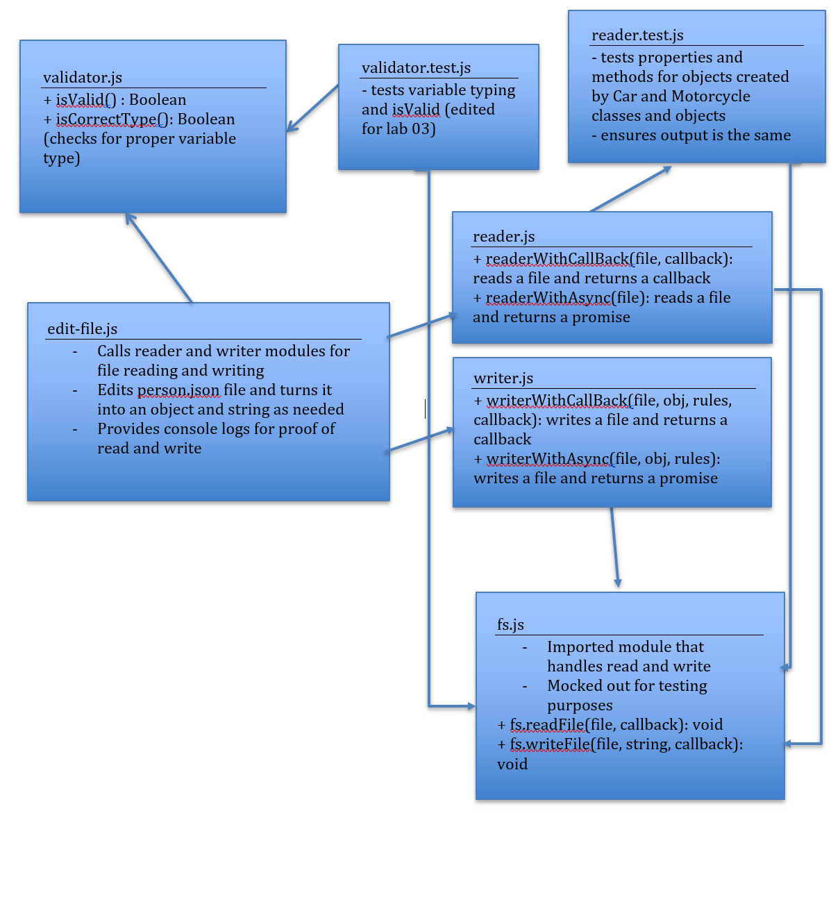

# LAB - Async (03)

## How I Learned to Love Async

### Author: Earl Jay Caoile

### Links and Resources
* [submission PR](https://github.com/js-401n15-eoc/lab-03/pull/1)
* [GitHub Actions](https://github.com/js-401n15-eoc/lab-03/actions)

#### Documentation
* [MDN docs (Callback)](https://developer.mozilla.org/en-US/docs/Glossary/Callback_function)
* [MDN docs (Promise)](https://developer.mozilla.org/en-US/docs/Web/JavaScript/Reference/Global_Objects/Promise)
* [MDN docs (Async)](https://developer.mozilla.org/en-US/docs/Web/JavaScript/Reference/Statements/async_function)

### Setup
#### Tests
* Testing command: `npm test` from root directory

#### UML
